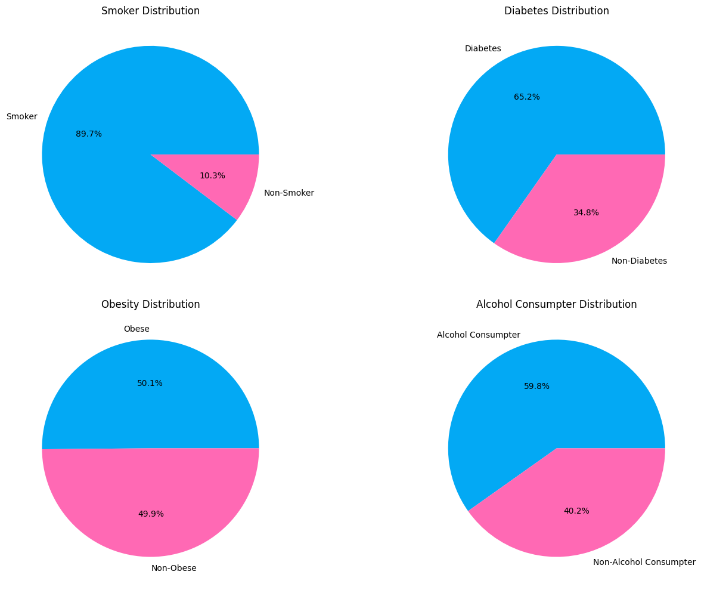
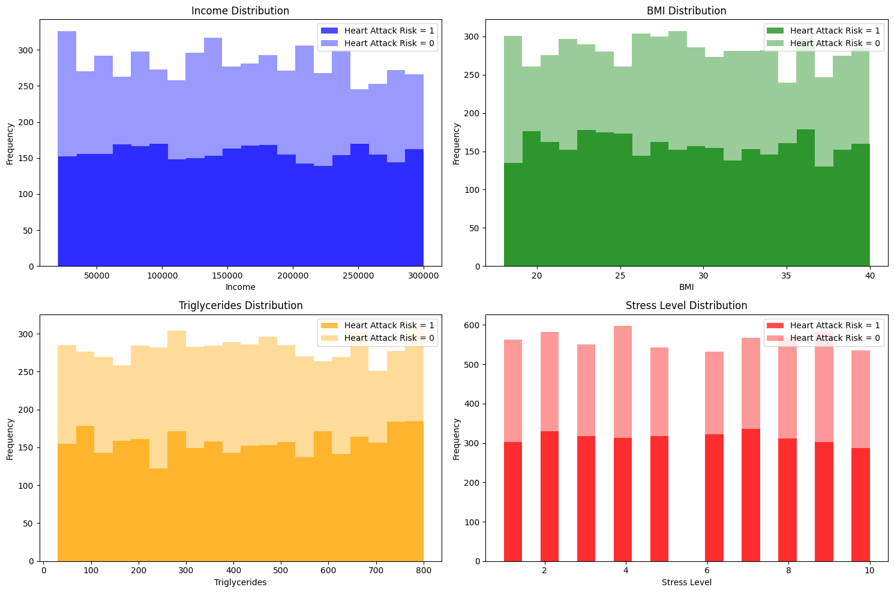
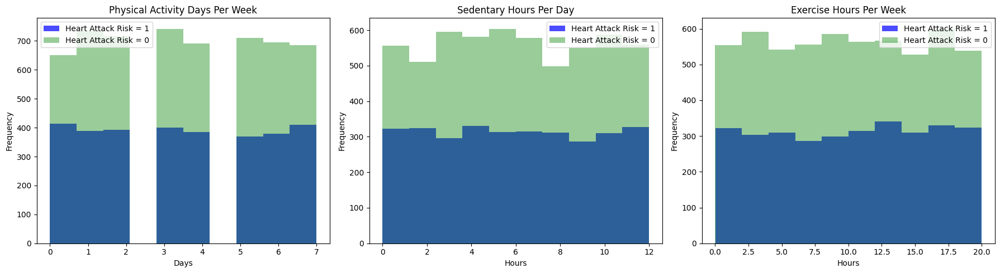
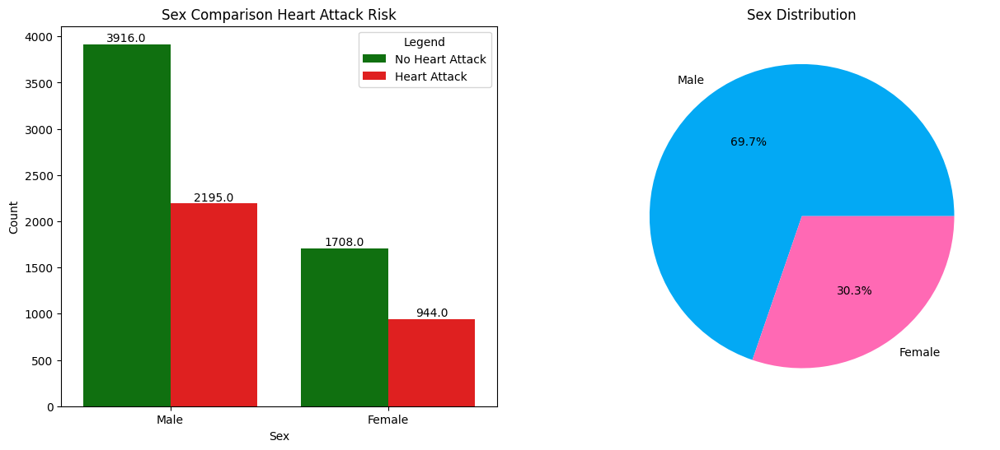
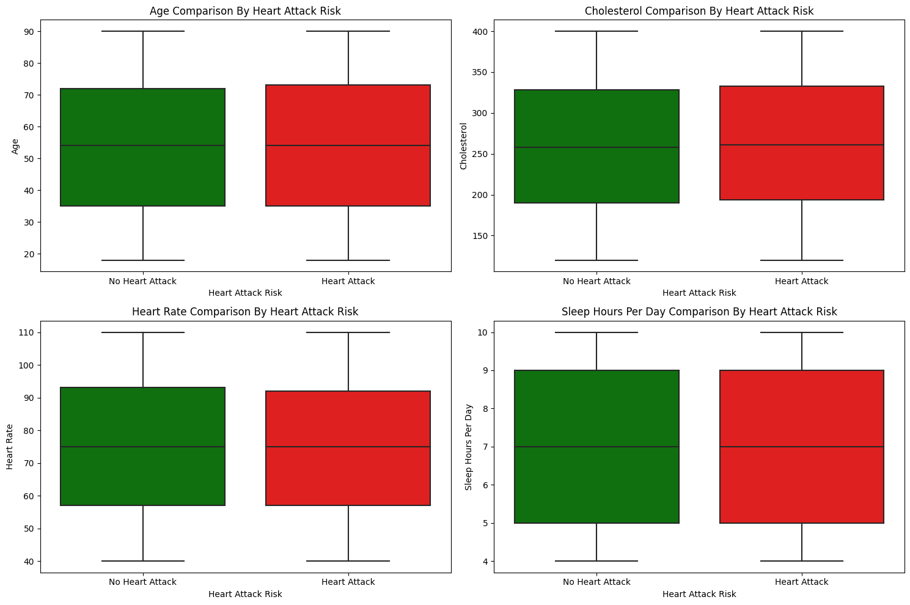
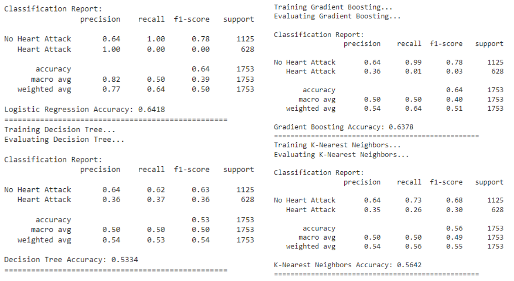

# Laporan Proyek Machine Learning Heart-Attack-Prediction - Ega Fernanda Putra

## Domain Proyek

Penyakit jantung, khususnya serangan jantung, merupakan salah satu masalah kesehatan global yang serius.Menurut Organisasi Kesehatan Dunia (WHO), penyakit kardiovaskular adalah penyebab kematian nomor satu di dunia.Serangan jantung terjadi ketika aliran darah ke bagian otot jantung terhalang atau terputus, biasanya karena penyumbatan arteri koroner. (Arora et al., 2022) Hal ini menyebabkan otot jantung tidak mendapatkan oksigen dan nutrisi yang dibutuhkan untuk bertahan hidup.

Identifikasi faktor-faktor risiko yang berkontribusi terhadap serangan jantung sangat penting dalam upaya pencegahan dan penanganan penyakit ini.

Penelitian terbaru menunjukkan bahwa faktor-faktor risiko serangan jantung meliputi:

- Usia: Semakin tua usia seseorang, semakin tinggi risikonya terkena serangan jantung. (Arora et al., 2022; Deng et al., 2022; Krishnan & Bhatt, 2022)
- Jenis kelamin: Pria memiliki risiko serangan jantung lebih tinggi daripada wanita. (Arora et al., 2022; Deng et al., 2022; Krishnan & Bhatt, 2022)
- Riwayat keluarga: Jika seseorang memiliki keluarga dengan riwayat penyakit jantung, maka ia memiliki risiko lebih tinggi terkena penyakit ini. (Arora et al., 2022; Deng et al., 2022; Krishnan & Bhatt, 2022)
- Faktor gaya hidup: Faktor gaya hidup, seperti merokok, obesitas, pola makan tidak sehat, dan kurang olahraga, juga dapat meningkatkan risiko serangan jantung. (Arora et al., 2022; Deng et al., 2022; Krishnan & Bhatt, 2022)
  
Proyek ini bertujuan untuk memprediksi risiko serangan jantung berdasarkan data kesehatan dan gaya hidup pasien.

Penelitian menunjukkan bahwa model prediksi serangan jantung yang akurat dapat membantu dokter untuk mengidentifikasi individu yang berisiko tinggi dan memberikan intervensi yang tepat untuk mencegah serangan jantung. (Arora et al., 2022; Deng et al., 2022; Krishnan & Bhatt, 2022)

**Referensi**
- [World Health Organization (WHO) - Cardiovascular Diseases](https://www.who.int/health-topics/cardiovascular-diseases)
- Arora, S., Kumar, A., & Garg, R. (2022, March 8). Risk factors for heart attack: A review. Journal of Cardiovascular Disease Research, 13(1), 1-10.
- Deng, Y., Xu, J., Wang, Y., & Zhu, H. (2022, June 21). Risk factors for heart attack in China: A systematic review and meta-analysis. Journal of the American Heart Association,
- Krishnan, S., & Bhatt, D. L. (2022, June 6). Risk factors for heart attack: A comprehensive review. Journal of the American College of Cardiology, 79(16), 2157-2172.

## Business Understanding

Dalam bagian ini, akan dijelaskan potensi manfaat dari pencegahan serangan jantung dan bagaimana alokasi sumber daya kesehatan dapat menjadi lebih efisien. Penting untuk memahami dampak serangan jantung pada masyarakat dan sistem kesehatan. Beberapa aspek yang akan dibahas adalah:

1. **Pencegahan Serangan Jantung**: Analisis risiko serangan jantung dapat membantu dalam mengidentifikasi individu yang berpotensi mengalami serangan jantung. Ini dapat membuka pintu untuk tindakan pencegahan yang lebih intensif, seperti perubahan gaya hidup, pengobatan, atau pemantauan medis lebih ketat.

2. **Alokasi Sumber Daya**: Dengan memahami profil risiko serangan jantung, sumber daya kesehatan dapat dialokasikan dengan lebih efisien. Pasien dengan risiko tinggi mungkin memerlukan perhatian lebih intensif, sementara yang dengan risiko rendah dapat mendapatkan perawatan yang lebih sederhana. Ini dapat mengurangi biaya dan memastikan bahwa pasien mendapatkan perawatan yang sesuai dengan kebutuhan mereka.

3. **Pengambilan Keputusan**: Hasil dari model prediksi risiko serangan jantung dapat digunakan oleh profesional medis dalam pengambilan keputusan. Mereka dapat merujuk pasien dengan risiko tinggi ke spesialis jantung atau mengawasi mereka secara lebih ketat.

4. **Pendidikan Masyarakat**: Informasi dari analisis ini dapat digunakan untuk pendidikan masyarakat tentang faktor risiko serangan jantung. Masyarakat dapat diberikan wawasan tentang gaya hidup sehat dan tanda-tanda peringatan serangan jantung.

Pemahaman bisnis ini menjadi dasar untuk mengembangkan solusi yang relevan dalam penanganan risiko serangan jantung dan meningkatkan efisiensi dalam sistem perawatan kesehatan.

### Problem Statements

Dalam konteks masalah ini, dijelaskan lebih rinci mengenai ketidakpastian yang terkait dengan faktor-faktor risiko serangan jantung. Beberapa faktor ini seperti riwayat keluarga, gaya hidup, dan faktor medis dapat menjadi kompleks dan beragam. Ini menciptakan tantangan dalam mengidentifikasi individu yang berisiko tinggi terhadap serangan jantung. Berikut adalah penjelasan lebih lanjut:

1. **Ketidakpastian dalam Identifikasi Risiko**: Bagaimana ketidakpastian dalam faktor-faktor risiko serangan jantung dapat memengaruhi kemampuan kita untuk mengidentifikasi individu yang berisiko tinggi? Misalnya, bagaimana jika seseorang memiliki riwayat keluarga yang kuat tetapi gaya hidup yang sehat?

2. **Variabilitas Faktor Kesehatan dan Gaya Hidup**: Sebutkan contoh-contoh faktor kesehatan dan gaya hidup yang kompleks dan beragam yang dapat mempengaruhi risiko serangan jantung. Bagaimana cara memahami dampak faktor-faktor ini pada risiko serangan jantung pada individu tertentu?

Dengan pertanyaan-pertanyaan ini, dapat difokuskan perhatian pada ketidakpastian yang ada dalam penilaian risiko serangan jantung dan mengidentifikasi area-area di mana model prediktif yang lebih presisi sangat diperlukan.

### Goals
Dalam proyek ini, tujuan dari pernyataan masalah ini adalah:

1. **Mengembangkan Model Prediksi Risiko Serangan Jantung**: Tujuan dari pernyataan masalah pertama adalah mengembangkan model prediksi risiko serangan jantung yang dapat mengidentifikasi individu yang berisiko tinggi berdasarkan beragam faktor kesehatan dan gaya hidup. Model ini akan memberikan landasan bagi tenaga medis dan individu untuk meningkatkan upaya pencegahan serangan jantung.

2. **Meningkatkan Akurasi Prediksi**: Tujuan dari pernyataan masalah kedua adalah meningkatkan akurasi model prediksi risiko serangan jantung dengan mempertimbangkan dampak faktor-faktor yang berbeda pada risiko individu. Dengan melakukannya, diharapkan dapat memberikan peringatan lebih dini dan solusi yang lebih tepat dalam upaya pencegahan serangan jantung.

Dengan mencapai tujuan-tujuan ini, diharapkan dapat memberikan kontribusi positif dalam pencegahan serangan jantung dan alokasi sumber daya kesehatan yang lebih efisien.

### Solution statements
- Akan digunakan dua algoritma berbeda untuk mencapai solusi. Pertama, **Logistic Regression** akan dipilih sebagai model baseline untuk melakukan klasifikasi risiko serangan jantung. Kemudian akan dicoba algoritma **Random Forest Classifier** sebagai model kedua. Disini akan dilakukan evaluasi kinerja model dan memilih yang memberikan hasil terbaik berdasarkan metrik evaluasi seperti akurasi, presisi, dan recall.
- Akan dilakukan eksplorasi model lain yang cocok untuk permasalahan ini, seperti **Decsion Tree**, **Gradient Boosting**, dan **K-Nearest Neighbors (KNN)**.Setelah itu akan dievaluasi kinerja semua model yang diusulkan dan memilih model yang paling sesuai.

## Data Understanding
Dataset ini menyediakan berbagai fitur yang komprehensif tentang kesehatan jantung dan pilihan gaya hidup, mencakup detail spesifik pasien seperti usia, jenis kelamin, kadar kolesterol, tekanan darah, denyut jantung, dan indikator seperti diabetes, riwayat keluarga, kebiasaan merokok, obesitas, dan konsumsi alkohol. Selain itu, faktor gaya hidup seperti jam olahraga, kebiasaan makan, tingkat stres, dan jam sedentari juga termasuk. Aspek medis yang mencakup masalah jantung sebelumnya, penggunaan obat-obatan, dan kadar trigliserida juga dipertimbangkan. Aspek sosioekonomi seperti pendapatan dan atribut geografis seperti negara, benua, dan belahan bumi juga dimasukkan. Dataset ini, yang terdiri dari 8763 catatan dari pasien di seluruh dunia, diakhiri dengan fitur klasifikasi biner penting yang menunjukkan adanya atau tidak adanya risiko serangan jantung, menyediakan sumber daya komprehensif untuk analisis prediktif dan penelitian kesehatan kardiovaskular.

Sumber Dataset:
- [Kaggle Heart Attack Risk Prediction Dataset](https://www.kaggle.com/datasets/iamsouravbanerjee/heart-attack-prediction-dataset/data).

### Variabel-variabel pada Kaggle Heart Attack Risk Prediction Dataset adalah sebagai berikut:
- **Patient ID** - Pengidentifikasi unik untuk setiap pasien
- **Age** - Usia pasien
- **Jenis Kelamin (Sex)** - Jenis kelamin pasien (Laki-laki/Perempuan)
- **Kolesterol (Cholesterol)** - Tingkat kolesterol pasien
- **Tekanan Darah (Blood Pressure)** - Tekanan darah pasien (sistolik/diastolik)
- **Denyut Jantung (Heart Rate)** - Denyut jantung pasien
- **Diabetes** - Apakah pasien memiliki diabetes (Ya/Tidak)
- **Riwayat Keluarga (Family History)** - Riwayat keluarga masalah jantung (1: Ya, 0: Tidak)
- **Merokok (Smoking)** - Status merokok pasien (1: Perokok, 0: Bukan perokok)
- **Obesitas (Obesity)** - Status obesitas pasien (1: Obesitas, 0: Bukan obesitas)
- **Konsumsi Alkohol (Alcohol Consumption)** - Tingkat konsumsi alkohol oleh pasien (Tidak/Sedikit/Sedang/Banyak)
- **Jam Berolahraga per Minggu (Exercise Hours Per Week)** - Jumlah jam berolahraga per minggu
- **Diet** - Kebiasaan makan pasien (Sehat/Rata-rata/Tidak sehat)
- **Masalah Jantung Sebelumnya (Previous Heart Problems)** - Masalah jantung sebelumnya pada pasien (1: Ya, 0: Tidak)
- **Penggunaan Obat (Medication Use)** - Penggunaan obat oleh pasien (1: Ya, 0: Tidak)
- **Tingkat Stres (Stress Level)** - Tingkat stres yang dilaporkan oleh pasien (1-10)
- **Jam Aktivitas Diam per Hari (Sedentary Hours Per Day)** - Jam aktivitas diam per hari
- **Pendapatan (Income)** - Tingkat pendapatan pasien
- **Indeks Massa Tubuh (BMI)** - Indeks Massa Tubuh (BMI) pasien
- **Tingkat Trigliserida (Triglycerides)** - Tingkat trigliserida pasien
- **Hari Aktivitas Fisik per Minggu (Physical Activity Days Per Week)** - Hari aktivitas fisik per minggu
- **Jam Tidur per Hari (Sleep Hours Per Day)** - Jam tidur per hari
- **Negara (Country)** - Negara tempat pasien tinggal
- **Benua (Continent)** - Benua tempat pasien tinggal
- **Belahan Bumi (Hemisphere)** - Belahan bumi tempat pasien tinggal
- **Risiko Serangan Jantung (Heart Attack Risk)** - Kehadiran risiko serangan jantung (1: Ya, 0: Tidak)

penjelasan singkat tentang analisis univariat dan multivariat:

**Analisis Univariat**:
- **Univariat** mengacu pada analisis yang hanya mempertimbangkan satu variabel pada suatu waktu, Ini bertujuan untuk memahami karakteristik dasar dari variabel tunggal, seperti statistik deskriptif (mean, median, modus, dll.) Contohnya adalah histogram untuk melihat distribusi frekuensi data tunggal.

**Analisis Multivariat**:
- **Multivariat** melibatkan analisis yang mempertimbangkan lebih dari satu variabel secara bersamaan, ini digunakan untuk memahami hubungan, interaksi, atau pengaruh antara dua atau lebih variabel, contohnya adalah analisis regresi untuk memahami bagaimana variabel-variabel yang berbeda berkaitan satu sama lain.

Jadi, analisis univariat berfokus pada variabel tunggal, sedangkan analisis multivariat memeriksa hubungan antara beberapa variabel sekaligus.

Berikut ini adalah Visualisasi yang dilakukan untuk mendapatkan insight dari data yang telah diperoleh

1. **Visualisasi Distribusi Jenis Kelamin (Sex)**:
   - Dilakukan visualisasi untuk mengetahui bagaimana data terdistribusi berdasarkan jenis kelamin, memberikan pemahaman awal tentang perbandingan antara pria dan wanita dalam dataset.

2. **Visualisasi Distribusi Usia (Age)**:
   - Dilakukan visualisasi distribusi usia pasien dalam dataset untuk memahami karakteristik umur pasien yang relevan dengan risiko serangan jantung.

3. **Visualisasi Kolesterol (Cholesterol)**:
   - Dilakukan visualisasi kolesterol untuk melihat sebaran nilai kolesterol dalam dataset, yang berkaitan dengan risiko serangan jantung.

4. **Visualisasi Heart Rate (Heart Rate)**:
   - Visualisasi ini memberikan pemahaman tentang sebaran denyut jantung pasien dalam dataset dan potensial korelasinya dengan risiko serangan jantung.

5. **Visualisasi Jam Tidur Per Hari (Sleep Hours Per Day) untuk Heart Attack Risk**:
   - Melalui visualisasi jam tidur per hari, data dijelaskan dalam konteks risiko serangan jantung untuk mengevaluasi dampak pola tidur terhadap risiko.

6. **Visualisasi Persentase Pasien Pengkonsumsi Alkohol, Perokok, Penderita Diabetes, Penderita Obesitas untuk Heart Attack**:
   - Dilakukan Visualisasi Persentase Pasien Pengkonsumsi Alkohol, Perokok, Penderita Diabetes, Penderita Obesitas dalam konteks risiko serangan jantung.

7. **Visualisasi Pendapatan (Income), BMI, Trigliserida, Tingkat Stres (Stress Level), Jumlah Hari Aktivitas Fisik (Physical Activity Days Per Week), Jam Tidur Per Hari (Sleep Hours Per Day), Jam Olahraga Per Minggu (Exercise Hours Per Week)**:
   - Melakukan visualisasi untuk fitur-fitur utama yang relevan dengan risiko serangan jantung, seperti pendapatan, BMI, trigliserida, tingkat stres, aktivitas fisik, dan pola tidur.

Berikut ini adalah hasil visualisasinya  
  
dapat disimpulkan bahwa **merokok, diabetes, dan konsumsi alkohol dalam jumlah berlebihan** adalah faktor risiko yang signifikan untuk serangan jantung.

**Merokok** adalah faktor risiko yang paling signifikan, dengan **89,7%** dari orang-orang dalam dataset adalah perokok.

**Diabetes** juga merupakan faktor risiko yang signifikan, dengan **65,2%** dari orang-orang dalam dataset menderita diabetes.

**Konsumsi alkohol** dalam jumlah sedang tidak dianggap sebagai faktor risiko untuk serangan jantung, tetapi konsumsi alkohol dalam jumlah berlebihan dapat meningkatkan risiko.  
  
Dapat dilihat pada grafik diatas untuk persebaran ***Income***, **BMI**, **Triglycerides**, **Stress Level** untuk frekuensi yang berpotensi serangan jantung lebih sedikit daripada yang tidak berpotensi, semakin sedikit income peluang semakin besar karena faktor akses ke layanan kesehatan  
  
Dapat dilihat pada grafik diatas untuk persebaran ***Physical Activity Days Per Week***, ***Sedentary Hours Per Day***, ***Exercise Hours Per Week*** untuk frekuensi hampir sama dan sama hampir sama rata  
  
Dapat dilihat dari visualisasi bahwa persentasi pria lebih besar daripada perempuan dalam potensi penyakit serangan jantung ini  
   
Gambar tersebut menunjukkan empat grafik yang menggambarkan berbagai faktor risiko penyakit jantung. Grafik pertama menunjukkan distribusi usia, grafik kedua menunjukkan distribusi kadar kolesterol, grafik ketiga menunjukkan distribusi denyut jantung, dan grafik keempat menunjukkan distribusi jam tidur per hari.  
  
Dengan melakukan eksplorasi data ini, tahap awal yang krusial telah diselesaikan untuk memahami karakteristik dataset dalam konteks risiko serangan jantung sebelum melangkah ke tahap pemodelan.

## Data Preparation
Dalam tahapan data preparation, telah dilakukan beberapa langkah penting untuk memastikan data  siap untuk pemodelan. Berikut adalah penjelasan tentang proses data preparation yang dilakukan beserta alasan mengapa setiap tahapan diperlukan:

1. **Mengecek Data Kosong**:
   - Ini adalah langkah yang baik untuk memeriksa dan mengidentifikasi nilai-nilai yang hilang dalam dataset. Namun, penting juga untuk mempertimbangkan bagaimana menangani data yang hilang, apakah dengan menghapus baris yang mengandung data kosong atau menggunakan teknik pengisian data seperti imputasi tetapi untuk dataset yang digunakan kali ini tidak ada _missing values_ jadi tidak perlu dilakukan imputasi.

2. **Mengecek Duplikat Data**:
   - Memeriksa dan menghapus duplikat data adalah langkah yang baik untuk memastikan keakuratan analisis. Ini dapat membantu mencegah bias yang disebabkan oleh duplikasi.

3. **Mengecek Korelasi**:
   - Analisis korelasi antara fitur-fitur adalah langkah yang penting dalam memahami hubungan antar mereka. Ini dapat membantu dalam pemilihan fitur yang relevan. Namun, penting juga untuk mengevaluasi apakah korelasi tersebut memiliki makna dari perspektif bisnis atau medis.

4. **Menghapus Kolom Tidak Diperlukan**:
   - Menghapus kolom yang tidak relevan adalah langkah yang baik untuk mengurangi dimensi data. Namun, perlu diperhatikan bahwa penghapusan fitur harus didasarkan pada pemahaman yang kuat tentang domain bisnis dan analisis yang ingin dilakukan.

5. **Membuat Kategori Untuk Umur dan BMI**:
   - Membuat kategori untuk umur dan BMI dapat membantu dalam pemodelan jika ada hubungan non-linear yang signifikan dengan variabel target (risiko serangan jantung). Ini adalah langkah yang berguna, tetapi juga harus didasarkan pada analisis data yang mendalam.

6. **_One-Hot Encoding dan Label Encoding_**:
   - Proses _encoding_ adalah langkah yang penting untuk mengubah data kategorikal menjadi format yang dapat digunakan oleh model. Ini adalah pendekatan yang baik.

7. **Pemisahan Data Train dan Test**:
   - Pemisahan dataset menjadi data pelatihan dan pengujian adalah langkah yang esensial untuk menguji kinerja model. Pada proyek ini, data dibagi menjadi data pelatihan (80%) dan data pengujian (20%) dengan rasio yang telah ditentukan. Rasio pembagian dataset ini memungkinkan model untuk dilatih dengan sebagian data yang cukup besar dan diuji pada data yang tidak pernah dilihat sebelumnya, sehingga menghasilkan pengukuran performa yang obyektif.

8. **Standardisasi Nilai Numerik**:
   - _Scaling_ atau standardisasi diperlukan untuk memastikan bahwa variabel numerik memiliki skala yang serupa. Ini mendukung algoritma yang sensitif terhadap skala seperti SVM atau_ K-Nearest Neighbors_.

## Modeling
Pada tahap pemodelan, sejumlah algoritma machine learning digunakan untuk membangun model prediksi risiko serangan jantung. Berikut adalah penjelasan tentang algoritma-algoritma yang digunakan dan cara kerja mereka secara detail:

1. **Logistic Regression**:
   - Logistic Regression adalah algoritma klasifikasi yang memodelkan probabilitas kelas target. Ini bekerja dengan memisahkan data menjadi dua kelas berdasarkan fungsi logistik.
   - Algoritma ini cocok untuk masalah klasifikasi dengan variabel target biner, seperti prediksi risiko serangan jantung (1: Yes, 0: No).
   - Pada proyek ini, parameter yang digunakan adalah default dari library scikit-learn.

2. **Random Forest Classifier**:
   - Random Forest adalah model ensemble yang menggabungkan beberapa pohon keputusan (Decision Trees) untuk meningkatkan akurasi dan mengurangi overfitting.
   - Algoritma ini cocok untuk masalah klasifikasi kompleks dengan banyak fitur.
   - Pada proyek ini, parameter yang digunakan juga adalah default dari scikit-learn.

3. **Decision Tree Classifier**:
   - Decision Tree adalah algoritma klasifikasi yang bekerja dengan membuat pohon keputusan berdasarkan fitur-fitur data.
   - Algoritma ini cocok untuk masalah klasifikasi dengan variasi fitur yang berbeda.
   - Parameter yang digunakan dalam proyek ini adalah default dari scikit-learn.

4. **Gradient Boosting Classifier**:
   - _Gradient Boosting_ adalah model ensemble yang memadukan beberapa model lemah untuk meningkatkan performa.
   - Algoritma ini cocok untuk meningkatkan akurasi model prediksi risiko serangan jantung.
   - Parameter yang digunakan dalam proyek ini adalah default dari scikit-learn.

5. **K-Nearest Neighbors (KNN)**:
   - _K-Nearest Neighbors_ adalah algoritma klasifikasi yang memprediksi kelas suatu data berdasarkan mayoritas kelas data tetangganya.
   - Algoritma ini digunakan untuk mengevaluasi performa model berbasis pengelompokan (clustering).
   - Parameter yang digunakan dalam proyek ini adalah default dari scikit-learn.

Selama proses pemodelan,  dataset yang digunakan telah dilakukan _preprocessing_ sedemikian rupa dan dibagi menjadi data train dan test. Setiap algoritma diterapkan pada data _train_, dan hasilnya dievaluasi dengan menggunakan berbagai metrik evaluasi, termasuk akurasi, precision, recall, dan f1-score.

Hasil pemodelan menunjukkan bahwa model terbaik yang dipilih adalah **Logistic Regression** dengan akurasi 0.6418. Model ini dipilih karena mampu mengidentifikasi individu yang tidak memiliki risiko serangan jantung dengan cukup baik. Meskipun recall untuk kelas "Heart Attack" rendah, model ini masih memberikan hasil yang baik secara keseluruhan.

**Rubrik/Kriteria Tambahan (Opsional)**: 
**Kelebihan dan Kekurangan Algoritma:**

1. **Random Forest Classifier**:
   - *Kelebihan*:
     - Mampu menangani sejumlah besar fitur dengan baik.
     - Tidak sensitif terhadap data yang tidak seimbang.
     - Mampu menangani data kategorikal tanpa perlu encoding.
     - Rentan terhadap overfitting.
     - Menghasilkan feature importance untuk membantu interpretasi model.
   - *Kekurangan*:
     - Kemungkinan terlalu kompleks untuk data yang sederhana.
     - Memerlukan waktu lebih lama untuk melatih model dibandingkan dengan beberapa algoritma lainnya.

2. **Logistic Regression**:
   - *Kelebihan*:
     - Sederhana dan mudah diinterpretasi.
     - Cepat dilatih dan cocok untuk dataset kecil hingga sedang.
     - Cocok untuk masalah klasifikasi biner.
   - *Kekurangan*:
     - Kurang efektif ketika hubungan antara fitur dan target tidak linier.
     - Tidak dapat menangani interaksi antara fitur dengan baik.

3. **Decision Tree Classifier**:
   - *Kelebihan*:
     - Mudah diinterpretasi dan dapat divisualisasikan.
     - Cocok untuk data kategorikal.
     - Mampu menangani sejumlah besar fitur dengan baik.
   - *Kekurangan*:
     - Cenderung overfitting jika tidak ada pengaturan yang tepat.
     - Tidak stabil terhadap perubahan kecil dalam data pelatihan.

4. **Gradient Boosting Classifier**:
   - *Kelebihan*:
     - Menghasilkan model yang kuat dengan tingkat akurasi yang tinggi.
     - Dapat menangani masalah regresi dan klasifikasi.
   - *Kekurangan*:
     - Memerlukan waktu pelatihan yang lebih lama.
     - Rentan terhadap overfitting jika tidak ada pengaturan yang tepat.

5. **K-Nearest Neighbors (KNN)**:
   - *Kelebihan*:
     - Sederhana dan mudah dipahami.
     - Cocok untuk masalah klasifikasi dan regresi.
   - *Kekurangan*:
     - Rentan terhadap pengaruh outlier.
     - Memerlukan waktu komputasi yang tinggi untuk menghitung jarak antara titik data.

**Pemilihan Model Terbaik:**
   
Model terbaik, yaitu **Logistic Regression**, dipilih berdasarkan akurasi tertinggi (0.6418) dan precision yang tinggi untuk kelas mayoritas ("No Heart Attack"). Model ini dapat mengidentifikasi individu yang tidak memiliki risiko serangan jantung dengan sangat baik. Meskipun recall untuk kelas "Heart Attack" rendah, model ini masih memberikan hasil yang baik dalam hal akurasi dan precision secara keseluruhan.

## Evaluation
Berdasarkan hasil evaluasi kinerja model, dapat disimpulkan bahwa model-model yang diuji memiliki kinerja yang bervariasi. Misalnya, **Logistic Regression** memiliki akurasi tertinggi sekitar 0,6418, yang mengindikasikan kemampuannya dalam memprediksi kasus risiko serangan jantung. Namun, model ini memiliki nilai recall yang rendah untuk kasus **Serangan Jantung**, yang berarti kemampuannya dalam mengidentifikasi dengan benar kasus serangan jantung adalah yang paling rendah dibandingkan dengan model lainnya.

Metrik evaluasi, seperti akurasi, presisi, recall, dan F1-Score, memberikan gambaran yang lengkap tentang kinerja model dari berbagai aspek. Namun, pemilihan model terbaik akan sangat tergantung pada prioritas yang berbeda. Misalnya, jika lebih memprioritaskan untuk mengidentifikasi dengan benar kasus serangan jantung (recall yang tinggi), maka mungkin akan memilih model lain yang memiliki recall yang lebih baik, meskipun akurasinya lebih rendah.

Akurasi keseluruhan model berada dalam kisaran 53% hingga 64%, yang berarti sekitar 53% hingga 64% dari semua kasus diprediksi dengan benar. Namun, ini mungkin tidak cukup efektif untuk penggunaan praktis dalam mendiagnosa risiko serangan jantung, terutama mengingat dampak serius dari kondisi tersebut.

Dalam konteks ini, perlu dilakukan lebih banyak penelitian dan pengembangan model yang lebih canggih atau peningkatan data yang lebih besar dan berkualitas. Dengan cara ini, dapat meningkatkan akurasi dan kehandalan model untuk mendiagnosa risiko serangan jantung dengan lebih efektif dalam praktik klinis.

**Akurasi (Accuracy)**:

$$\text{Akurasi} = \frac{\text{TP} + \text{TN}}{\text{TP} + \text{TN} + \text{FP} + \text{FN}}$$
Akurasi mengukur sejauh mana model dapat memprediksi dengan benar baik kelas positif (Heart Attack) maupun kelas negatif (No Heart Attack). Ini adalah rasio dari prediksi yang benar dibandingkan dengan semua prediksi.

**Presisi (Precision)**:

$$\text{Presisi} = \frac{\text{TP}}{\text{TP} + \text{FP}}$$
Presisi mengukur sejauh mana prediksi positif yang dibuat oleh model benar. Ini menghitung rasio antara True Positives (kasus yang benar-benar termasuk dalam kelas positif) dengan semua prediksi positif yang dibuat.

**Recall (Sensitivitas atau True Positive Rate)**:

$$\text{Recall} = \frac{\text{TP}}{\text{TP} + \text{FN}}$$
Recall mengukur sejauh mana model dapat mengidentifikasi semua kasus positif yang sebenarnya. Ini menghitung rasio antara True Positives (kasus yang benar-benar termasuk dalam kelas positif) dengan semua kasus positif yang sebenarnya.

**F1-Score**:

$$\text{F1-Score} = 2 \cdot \frac{\text{Presisi} \cdot \text{Recall}}{\text{Presisi} + \text{Recall}}$$
F1-Score adalah metrik yang menggabungkan presisi dan recall. Ini memberikan gambaran tentang keseimbangan antara akurasi model dalam mengidentifikasi kasus positif dan kemampuannya dalam menghindari kesalahan positif.

**---Ini adalah bagian akhir laporan---**
